# 🏛️ ATORIA — 경주 문화유산 체험형 모바일 서비스

> **"방문하는 순간이 한 편의 이야기가 되는"**
> AI 스토리, 현장 미션, 지도 기반 동선, Unity 게임을 하나의 흐름으로 묶은 안드로이드 앱

<div align="center">


</div>

- **서비스명**: ATORIA (아토리아)
- **프로젝트 기간**: 2026.04 ~ 2026.05
- **개발 인원**: 6명
- **본인 담당**: 프론트엔드(Android · Jetpack Compose) · 게임(Unity 모듈 Android 연동)

<p align="center">
  
</p>

---

## 📌 목차

1. [기획 배경](#1-기획-배경)
2. [핵심 화면 한눈에 보기](#2-핵심-화면-한눈에-보기)
3. [사용자 시나리오](#3-사용자-시나리오)
4. [핵심 기술 상세](#4-핵심-기술-상세)
5. [시스템 아키텍처](#5-시스템-아키텍처)
6. [개인 기여](#6-개인-기여)
7. [기술 스택](#7-기술-스택)
8. [프로젝트 구조](#8-프로젝트-구조)
9. [실행 방법](#9-실행-방법)
10. [팀 구성](#10-팀-구성)

---

## 1. 기획 배경

### 기존 문화유산 여행 앱에서 느낀 한계

기존 문화유산 앱은 대부분 **정보 나열**에 그칩니다. 장소 설명, 지도, 후기 중심의 평면적 구성이라 정작 현장에 도착해도 *무엇을 보고, 무엇을 해야 할지*가 분명치 않습니다. 어린이나 가족 단위 방문자에게는 역사 설명만으로 흥미를 끌기 어렵고, 탐방이 끝난 뒤에도 사진과 기억이 흩어져 다시 꺼내볼 수 있는 결과물이 남지 않습니다.

### ATORIA가 제안한 방향

> **"방문 자체가 하나의 이야기와 미션이 되도록"**

- 인원·연령·성향에 맞춰 **AI가 탐방 전용 스토리 + 장소별 미션** 생성
- 지도 기반 동선과 현장 미션을 결합해 **방문 자체를 게임처럼** 만든 흐름
- **CameraX 촬영 결과를 로컬 ONNX 모델로 판별**해 현장에서 미션 통과 여부를 즉시 확인
- 탐방 종료 후 스토리·미션 결과·사진을 엮은 **동화책 형태의 e-book** 결과물 제공
- 앱 안에서 실행되는 **Unity 게임 콘텐츠**로 탐방 사이의 몰입형 휴식 경험

<p align="center">
  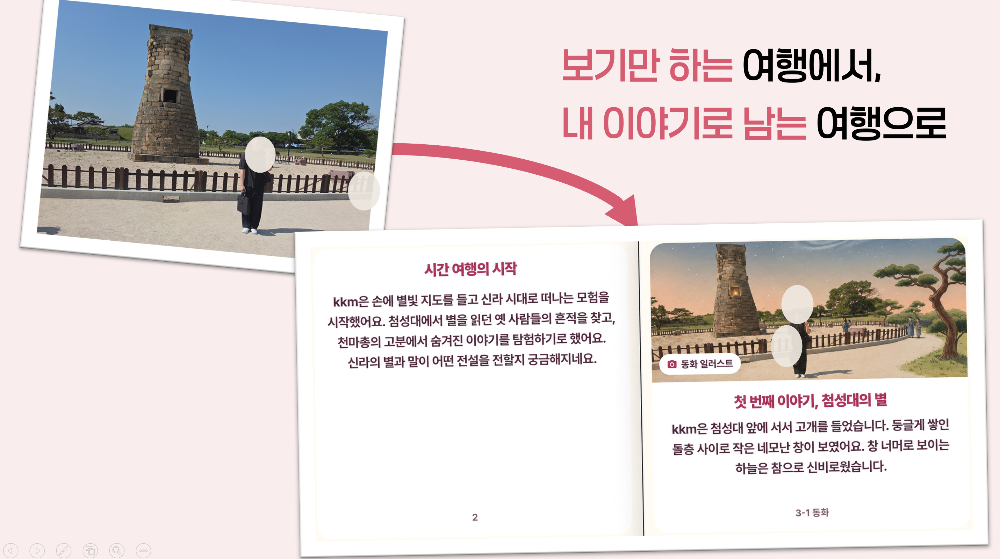
</p>

---

## 2. 핵심 화면 한눈에 보기

| 기능 | 스크린샷 | 핵심 기술 |
|---|---|---|
| **코스 선택** | 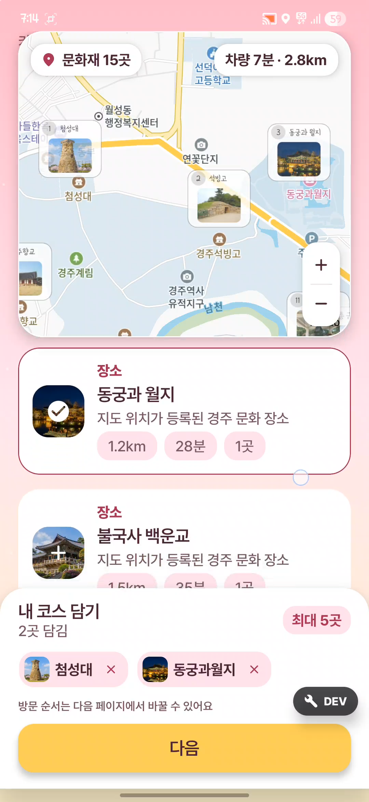 | Kakao Map ↔ Compose 단일 상태 동기화 |
| **코스 순서 조정** | 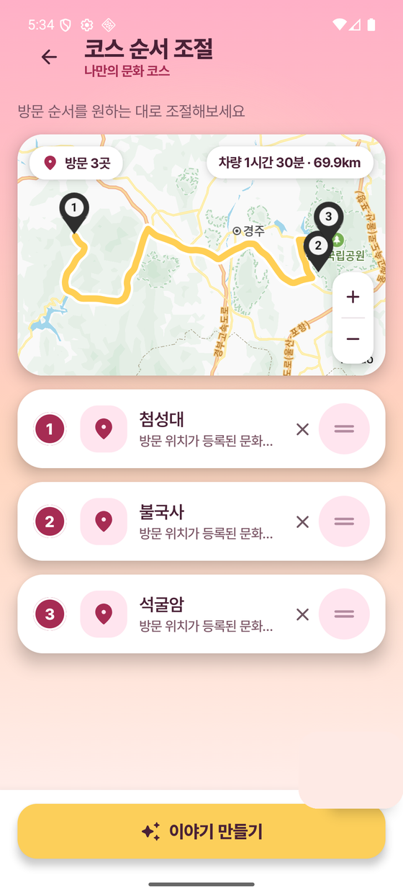 | Kakao Directions · 경로 재계산 |
| **미션 경로** | 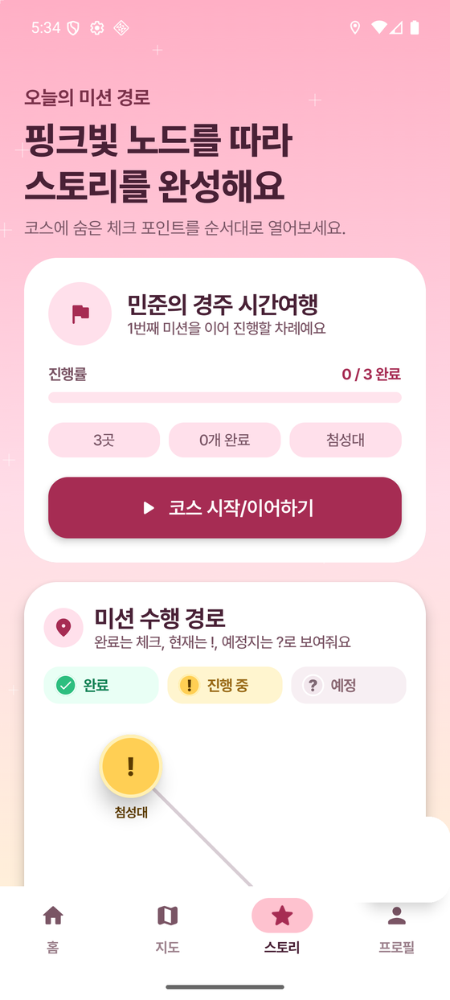 | Foreground Service · 좌표 샘플링 |
| **미션 상세** | 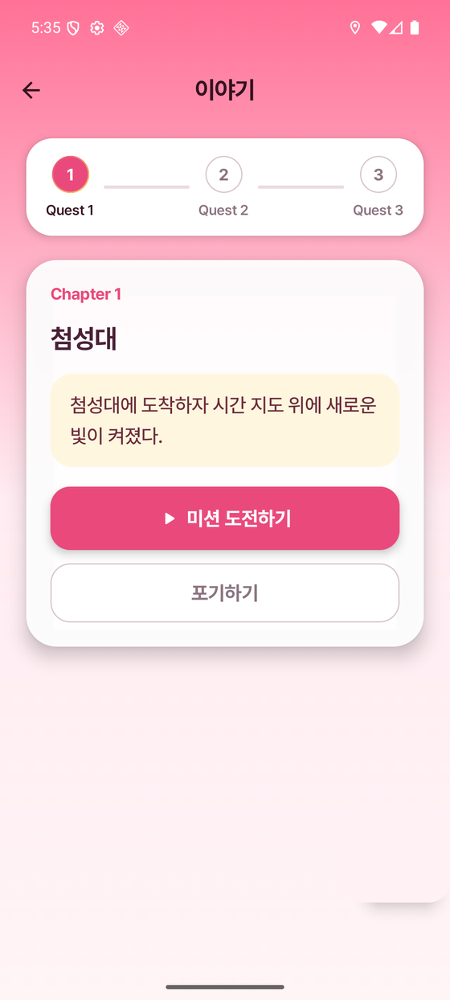 | AI 생성 스토리 + 챕터 진행 |
| **온디바이스 검증** | 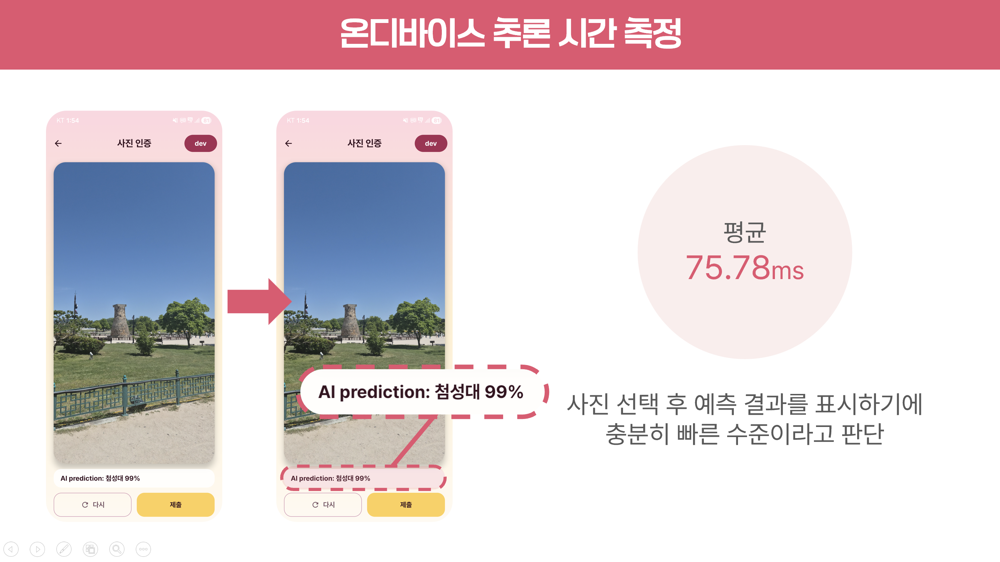 | CameraX · 로컬 ONNX · 평균 75.78ms |
| **동화책 완성** |  | e-book 구조 → Compose 페이지 |
| **e-book 뷰어** | 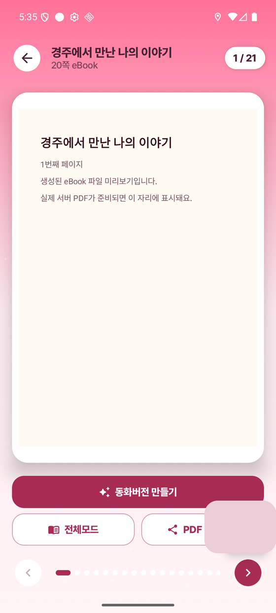 | 페이지 분할 · 전체화면 · PDF 공유 |
| **Unity 게임** |  | UnityPlayerGameActivity · 단일 APK |

---

## 3. 사용자 시나리오

ATORIA의 가치는 한 장의 사진이 어떻게 **이야기 → 미션 → 검증 → 동화책**으로 이어지는가에 있습니다. 실제 첨성대와 천마총에서 촬영한 결과로 흐름을 따라가 보겠습니다.

### 3-1. AI가 만든 첫 번째 이야기 — "별빛을 찾아서"

| 미션 시작 (스토리 도입) | 미션 + 힌트 |
|:---:|:---:|
| 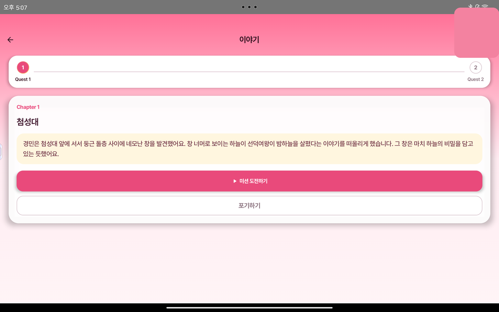 | 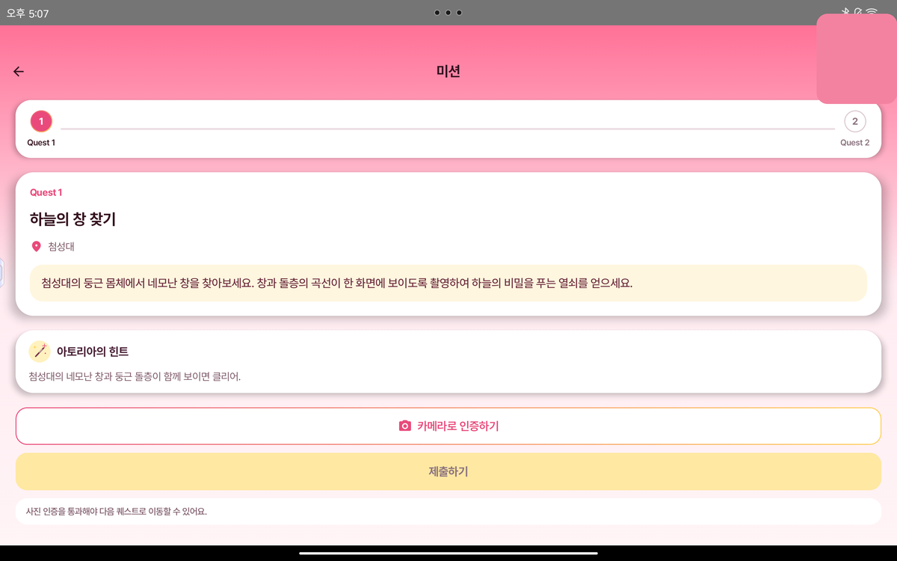 |

- AI 서버(FastAPI + RAG)가 **인원·성향 설문**을 입력으로 받아 *주인공이 등장하는 동화 형태의 스토리*를 생성합니다.
- 장소별로 *"네모난 창과 둥근 돌층의 곡선이 한 화면에 보이도록 촬영하라"* 같은 **구체적 미션 + 힌트**를 함께 내려줍니다.

### 3-2. 현장 사진 → 로컬 ONNX 판별 → 인물 검출

| 원본 사진 (ONNX 분류) | 주인공 자동 탐지 |
|:---:|:---:|
| 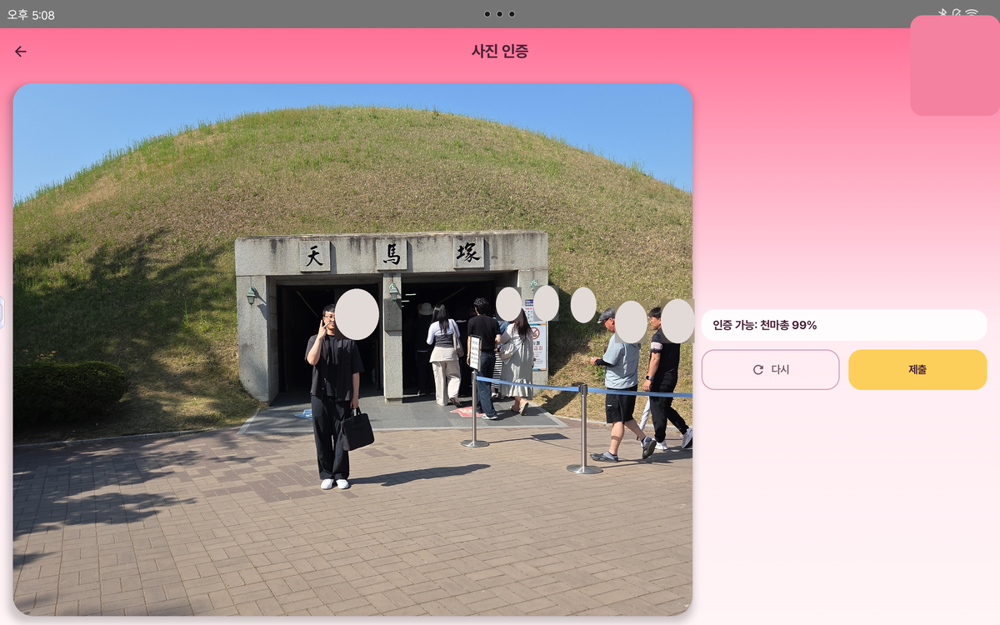 | 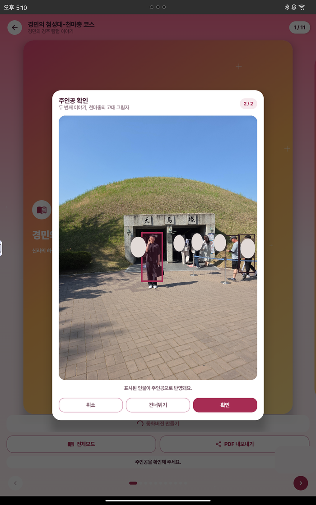 |

- 촬영 즉시 **앱 안에서** `HeritageClassifier`(ONNX) 가 *"천마총 99%"* 와 같이 판별 → 잘못된 사진의 S3 업로드를 사전 차단.
- ML Kit 얼굴/인물 검출로 동화책에 들어갈 **주인공을 자동 식별**해 다음 단계에 넘깁니다.

### 3-3. 결과물 — 사진과 이야기가 엮인 동화책

| 첨성대 동화 페이지 | 천마총 동화 페이지 |
|:---:|:---:|
| 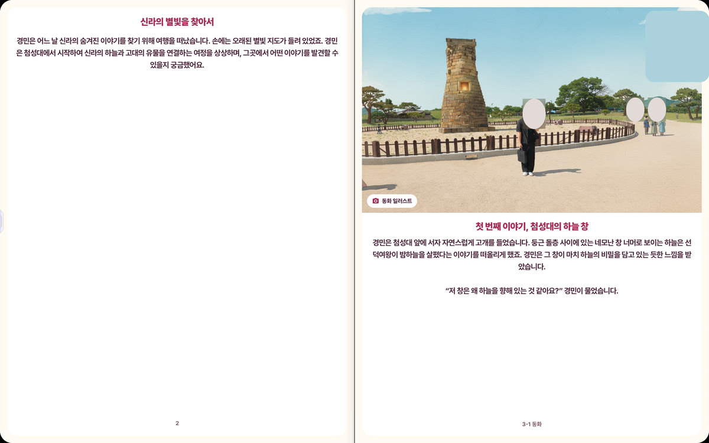 | 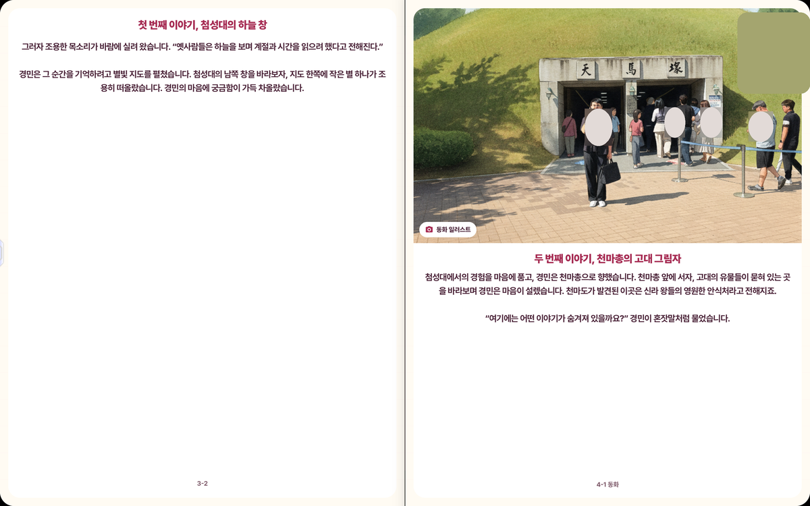 |

- AI 서버가 반환한 **e-book 구조(페이지·본문·이미지 힌트·캡션)** 를 Compose 책 페이지로 렌더링합니다.
- 사용자가 찍은 실제 사진이 **본인이 주인공인 동화의 삽화**로 자연스럽게 자리잡습니다.
- 원격 PDF가 있으면 다운로드·캐시 → 전체화면 읽기 모드 → PDF 저장·공유까지 한 흐름으로 연결.

> 💡 **왜 이 흐름이 의미 있는가?**
> "어디에 가라 / 무엇이 있다"는 정보 전달이 아니라, **방문 → 미션 수행 → 인증 → 결과물**이라는 행동 사이클을 만들었다는 점입니다. 게임에서 흔히 쓰이는 *퀘스트 루프*를 문화유산 체험에 그대로 옮겨 적용했습니다.

---

## 4. 핵심 기술 상세

### 4-1. Compose × 명령형 Kakao Map SDK 브리징

<details>
<summary><b>기술 상세 펼치기</b></summary>

#### 왜 어려운 문제인가

Kakao Map SDK는 `addMarker()`, `moveCamera()` 같은 **명령형 API**로 동작합니다. 반면 Jetpack Compose는 **선언형 상태 → UI 리렌더**가 기본 모델입니다. 두 패러다임이 어긋나면, "카드를 탭했는데 지도 핀이 갱신되지 않는" 종류의 어긋남이 발생합니다.

#### 해결 — 선택 바구니/지도 핀/경로를 단일 상태로 묶기

```
   ┌──────────────────────────────────────────┐
   │  CourseSelectViewModel                   │
   │   • selectedPlaces: StateFlow<List<Place>>│
   │   • mapPins:        derived              │
   │   • routePolyline:  derived              │
   └──────────────┬───────────────────────────┘
                  │ collectAsState()
        ┌─────────┴──────────┐
        ▼                    ▼
  Compose 카드 리스트      Kakao Map (AndroidView)
        │                    │
        └── 같은 데이터 ─────┘
```

- ViewModel이 진실의 원천(SSoT). 카드 탭/지도 탭/순서 변경 모두 동일한 `selectedPlaces` 를 갱신.
- `AndroidView` 안에서 마커는 `key(place.id)` 단위로 add/remove하여 불필요한 재생성 방지.
- Directions 응답이 없는 경우 **Compose Canvas 기반 fallback map** 으로 빈 화면 없이 흐름 유지.

| 코스 선택 (지도 + 카드) | 코스 순서 조정 (Directions) |
|:---:|:---:|
|  |  |

</details>

### 4-2. CameraX + 로컬 ONNX 현장 검증 파이프라인

<details>
<summary><b>기술 상세 펼치기</b></summary>

#### 전체 데이터 흐름

```
[사용자]      [QuestCameraScreen]     [HeritageClassifier]    [Matcher]      [Backend / S3]
   │                │                        │                  │                 │
   │ 셔터 탭         │                        │                  │                 │
   │───────────────▶│                        │                  │                 │
   │                │ CameraX 캡처            │                  │                 │
   │                │ → JPEG + EXIF          │                  │                 │
   │                │                        │                  │                 │
   │                │ Bitmap → 224×224 정규화 │                  │                 │
   │                │───────────────────────▶│                  │                 │
   │                │                        │ ONNX 추론         │                 │
   │                │                        │ → top-k labels   │                 │
   │                │◀───────────────────────│                  │                 │
   │                │                        │                  │                 │
   │                │  미션 장소명 == top-k?   │                  │                 │
   │                │─────────────────────────────────────────▶│                 │
   │                │                        │                  │ 통과 / 실패       │
   │                │◀─────────────────────────────────────────│                 │
   │                │                        │                  │                 │
   │                │ ✅ 통과: Presigned URL 요청 → S3 업로드 → 미션 제출           │
   │                │ ❌ 실패: "다시 촬영" 안내 (네트워크 비용 0)                    │
```

#### 핵심 결정 — *왜 분류를 클라이언트에서 하는가?*

| 항목 | 서버 분류 | **로컬 ONNX 분류** ✅ |
|---|---|---|
| 잘못된 사진의 업로드 비용 | S3 PUT + 분류 API 호출 모두 발생 | **0** (앱에서 차단) |
| 사용자 피드백 지연 | 네트워크 RTT + 추론 시간 | **즉시** (~150ms) |
| 오프라인 대응 | 불가 | **가능** |
| 서버 부하 | 분류 + 매칭 모두 서버 | 매칭만 서버 |

오답률이 높은 사진(전혀 다른 장소, 카메라 가린 손가락 등)은 **앱 안에서 즉시 거부**하고, 통과한 사진만 S3에 올립니다. S3 비용과 백엔드 분류 부하를 동시에 줄이는 설계입니다.

<p align="center">
  
</p>

#### 위변조 방어 — EXIF · GPS · 분류 결과 삼중 검증

```kotlin
// 1) EXIF에서 촬영 좌표 추출
val exifLat = exifInterface.latLong?.first
val exifLng = exifInterface.latLong?.second

// 2) 현재 GPS와 비교 (사진 라이브러리에서 고른 옛 사진 차단)
val gpsDelta = haversine(currentGps, exifGps)
if (gpsDelta > 200.meters) return Reject(reason = "EXIF 좌표가 현재 위치와 너무 멀어요")

// 3) 분류 결과가 미션 장소 라벨과 일치하는지
val topK = classifier.classify(bitmap, k = 3)
if (mission.placeKey !in topK.map { it.label }) return Reject(reason = "다른 장소로 보여요")
```

</details>

### 4-3. 위치 기반 동선 기록 — 두 모드 분기

<details>
<summary><b>기술 상세 펼치기</b></summary>

코스 탐방 모드에 따라 두 가지 경로 기록 모드를 분기했습니다.

| 모드 | 사용 시점 | 권한 | 배터리 |
|---|---|---|---|
| **Foreground only** | 앱이 화면에 떠 있는 동안 | `ACCESS_FINE_LOCATION` | 낮음 |
| **Foreground Service** | 백그라운드에서도 기록 | `+ FOREGROUND_SERVICE_LOCATION` (Android 14+) | 중간 |

#### 좌표 샘플링

```kotlin
// RouteTracker.kt
locationRequest = LocationRequest.Builder(
    Priority.PRIORITY_BALANCED_POWER_ACCURACY,
    interval = 60_000L           // 1분
).setMinUpdateDistanceMeters(5f) // 5m
 .build()
```

- 1분 / 5m 더블 게이트로 **지도가 너무 촘촘해지지 않으면서도 끊김 없이** 기록.
- Android 14+에서는 `foregroundServiceType="location"` 명시 필수.

</details>

### 4-4. Unity 모듈 통합 빌드

<details>
<summary><b>기술 상세 펼치기</b></summary>

| Unity 인트로 | 인게임 플레이 |
|:---:|:---:|
|  | 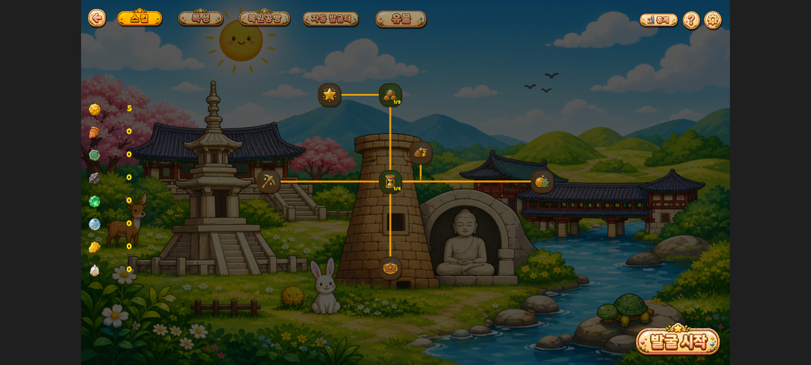 |

#### 구조

```
ATORIA APK (단일 파일)
├── :app          (Compose / Kotlin)
└── :unityLibrary (Unity Export · IL2CPP · arm64-v8a)
        └── UnityPlayerGameActivity ← fullscreen landscape
```

#### 빌드 안정화 과제와 해결

| 문제 | 원인 | 해결 |
|---|---|---|
| 디바이스별 .so 충돌 | 멀티 ABI 패키징 | `arm64-v8a` 단일 ABI 고정 |
| Unity 라이브러리 stripping | R8/Proguard | `useLegacyPackaging = true` + keep rules |
| Unity NDK 경로 불일치 | 팀원별 환경 상이 | `local.properties` → 환경변수 → SDK 순 다중 탐색 |
| Compose 복귀 시 상태바 깨짐 | Unity가 system insets 덮어씀 | 액티비티 전환 시 테마/orientation/insets 복원 |

</details>

### 4-5. e-book 구조 → Compose 책 페이지

<details>
<summary><b>기술 상세 펼치기</b></summary>

| 결과 안내 | 뷰어 |
|:---:|:---:|
|  |  |

AI 서버가 반환하는 e-book 구조는 다음과 같습니다.

```json
{
  "title": "경주에서 만난 나의 이야기",
  "pages": [
    {
      "index": 1,
      "body":  "경민은 첨성대 앞에 서서…",
      "image_hint": "user_photo:천마총_01",
      "caption": "두 번째 이야기, 천마총의 고대 그림자"
    }
  ],
  "pdf_url": "https://…/ebook/12345.pdf"
}
```

- `pdf_url` 이 있으면 `EbookFileRepository` 가 다운로드 + 캐시하고 PDF 뷰어로 렌더.
- 없으면 본문을 페이지 단위로 분할해 Compose 책 페이지로 직접 렌더 (긴 본문이 한 페이지에 몰리지 않도록 글자 수 기반 분할 알고리즘 적용).
- PDF 저장 / 시스템 공유 시트(`Intent.ACTION_SEND`)도 같은 화면에서 트리거.

</details>

### 4-6. ONNX 모델 트러블슈팅

<details>
<summary><b>기술 상세 펼치기</b></summary>

모델 검증 과정에서 단순히 "장소가 화면에 보이는가"만으로는 충분하지 않았습니다. 실제 현장 사진은 가로/세로 방향, 원근, 계절 장식처럼 조건이 계속 바뀌기 때문에, 오분류가 발생한 케이스를 따로 모아 데이터와 매칭 기준을 보강했습니다.

<p align="center">
  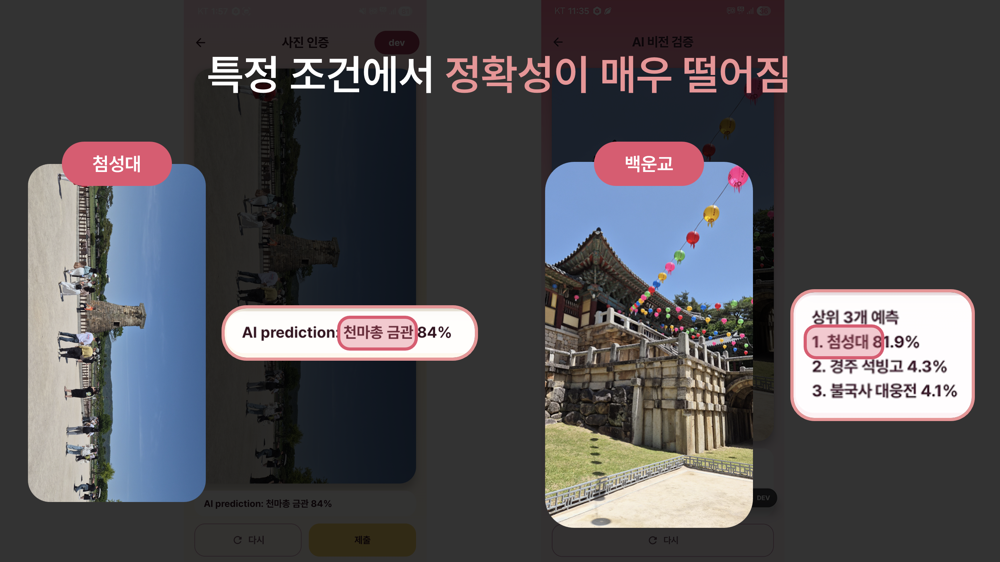
</p>

| Case 1. 가로 사진 분류 불안정 | Case 2. 연등 장식으로 인한 특징 왜곡 |
|:---:|:---:|
| 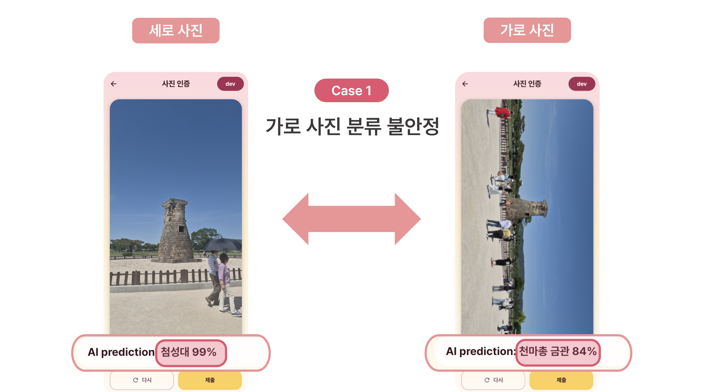 | 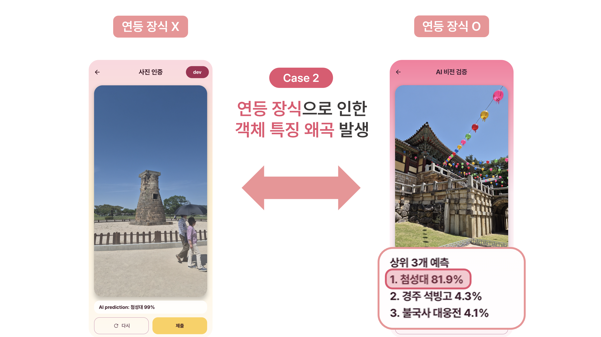 |

<p align="center">
  
</p>

- 세로 정면 이미지에 치우친 데이터만으로는 가로 촬영, 멀리서 찍은 사진, 장식물이 섞인 사진에서 confidence가 흔들렸습니다.
- 특이 케이스를 별도 데이터로 보강하고 top-k 결과를 미션 장소명과 매칭해, 단일 confidence 하나에만 의존하지 않도록 조정했습니다.

</details>

---

## 5. 시스템 아키텍처

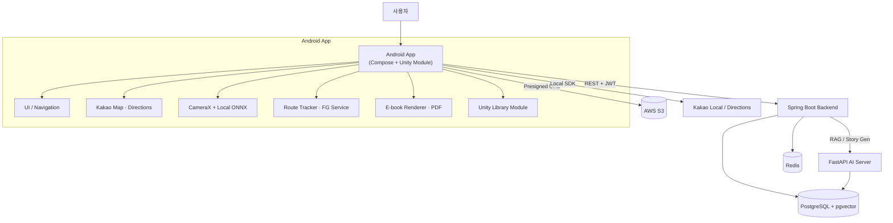

### 데이터 흐름

```
사용자 → 인원·성향 설문 → 코스 선택/순서 조정
                              │
                              ▼
                  Spring Boot ──→ FastAPI AI Server
                              │      (스토리 / 미션 생성, RAG)
                              ▼
                     장소별 스토리·미션 응답
                              │
                              ▼
                  Android: 지도 + 퀘스트 진행
                              │
                              ▼
              CameraX → EXIF/GPS → ONNX 분류 → 매칭
                              │
                              ▼
               Presigned URL → S3 업로드 → 미션 제출
                              │
                              ▼
          탐방 종료 → e-book 생성 → Compose 책 페이지 / PDF
```

---

## 6. 개인 기여

> Android 프론트엔드 전반과 Unity 모듈 Android 연동을 담당했습니다.
> 사용자가 직접 만지는 모든 화면과, 빌드/배포까지 이어지는 Unity 통합이 제 영역이었습니다.

| 영역 | 구체적 작업 | 기술 포인트 |
|---|---|---|
| **앱 진입 / 인증** | `MainActivity` 딥링크 + `CultureAppViewModel` 토큰 복원 + 자동 로그인 분기 | DataStore · OAuth 딥링크 · refresh 만료 처리 |
| **코스 선택 / 지도 UX** | 카드·바구니·핀·경로를 단일 상태로 동기화 | Compose ↔ 명령형 SDK 브리징, Canvas fallback map |
| **미션 카메라** | CameraX 촬영 → EXIF/GPS → ONNX → 매칭 → 업로드, 오분류 케이스 분석 | `HeritageClassifier`, `HeritageMissionMatcher` 직접 구현 |
| **이동 경로 기록** | foreground / foreground service 두 모드 | `RouteTracker`, `RouteTrackingService`, `RouteHistoryStore` |
| **e-book 뷰어** | AI 응답 → Compose 책 페이지 + 원격 PDF 캐시 | `StoryBookViewerScreen`, `EbookFileRepository`, 페이지 분할 |
| **Unity 모듈 연동** | `unityLibrary` 멀티모듈, fullscreen activity, NDK 경로 다중 탐색 | IL2CPP, arm64-v8a, legacy JNI packaging |
| **공통 UI 시스템** | 테마·모달·바텀시트·로딩, 시스템 바/인셋 일관 제어 | 모드별(미션·지도·게임·e-book) 인셋 분기 |

### 관련 코드

```text
frontend/app/src/main/kotlin/com/ssafy/culture/
├── MainActivity.kt
├── ui/CultureApp.kt
├── ui/navigation/CultureNavGraph.kt
├── ui/screen/
│   ├── course/CourseSelectScreen.kt
│   ├── course/CourseOrderScreen.kt
│   ├── camera/QuestCameraScreen.kt
│   └── story/StoryBookViewerScreen.kt
├── data/
│   ├── ml/HeritageClassifier.kt          # ONNX 분류기
│   ├── ml/HeritageMissionMatcher.kt      # top-k 매칭
│   ├── route/RouteTracker.kt
│   ├── route/RouteTrackingService.kt
│   ├── route/RouteHistoryStore.kt
│   ├── ebook/EbookFileRepository.kt
│   ├── ebook/FairyTaleImageRepository.kt
│   ├── repository/KakaoDirectionsRepository.kt
│   └── repository/KakaoLocalRepository.kt
│
frontend/
├── settings.gradle.kts
├── app/build.gradle.kts
└── unityLibrary/
    ├── build.gradle
    ├── src/main/AndroidManifest.xml
    └── src/main/java/com/unity3d/player/UnityPlayerGameActivity.java
```

---

## 7. 기술 스택

| 분류 | 스택 |
|---|---|
| **Android** | Kotlin · Jetpack Compose · Material 3 · Navigation Compose · Hilt |
| **State / 저장** | ViewModel · StateFlow · DataStore · Room |
| **Network** | Retrofit 3 · OkHttp · Gson Converter |
| **Map / 위치** | Kakao Map SDK · Kakao Local / Directions API · LocationManager · Foreground Service |
| **Camera / ML** | CameraX · MediaStore · FileProvider · S3 Presigned URL · ONNX Runtime Android · ML Kit |
| **Game** | Unity · UnityPlayerGameActivity · IL2CPP · Android GameActivity · arm64-v8a |
| **Backend** | Java 21 · Spring Boot 3.5 · Spring Security · JPA · WebFlux · Redis · PostgreSQL · S3 |
| **AI Server** | FastAPI · SQLAlchemy · pgvector · OpenAI SDK · RAG pipeline |
| **Infra** | Docker Compose · Nginx · PostgreSQL pgvector · Redis |
| **Collaboration** | Git · GitLab · Jenkins · Jira · Notion |

---

## 8. 프로젝트 구조

```text
Atoria2/
├── frontend/                          # Android 앱
│   ├── app/
│   │   └── src/main/kotlin/com/ssafy/culture/
│   │       ├── ui/                    # 화면, 내비게이션, 테마, 공통 컴포넌트
│   │       ├── data/                  # API, Repository, ML, route, ebook
│   │       ├── domain/                # 도메인 모델
│   │       └── di/                    # Hilt 모듈
│   ├── unityLibrary/                  # Unity Android export 모듈
│   ├── shared/
│   └── settings.gradle.kts
├── backend/                           # Spring Boot API 서버
├── ai/                                # FastAPI AI 마이크로서비스 (RAG)
├── db/                                # PostgreSQL / pgvector 초기화
├── nginx/                             # 배포용 reverse proxy
├── assets/readme/                     # README용 공개 이미지
├── docs/                              # 컨벤션 / 노트
├── Dockerfile.jenkins
├── Jenkinsfile
└── docker-compose.yml
```

---

## 9. 실행 방법

### 사전 요구사항

- Android Studio (Hedgehog 이상 권장) · JDK 21
- Unity Editor (Unity Library export 산출물 포함 상태)
- Docker · Docker Compose
- Kakao Developers의 Native App Key · REST API Key

### 전체 서버 실행

```bash
docker compose up --build
# nginx · backend · ai · db(pgvector/pgvector:pg16) · redis
```

### Android 앱

```bash
cd frontend
./gradlew :app:assembleDebug
```

`frontend/local.properties` 예시:

```properties
sdk.dir=YOUR_ANDROID_SDK_PATH
kakao.native.app.key=YOUR_KAKAO_NATIVE_KEY
kakao.rest.api.key=YOUR_KAKAO_REST_KEY
gms.api.key=YOUR_GMS_KEY
api.base.url=http://YOUR_SERVER/api/

# Unity 빌드가 필요한 경우
unity.androidSdkPath=YOUR_ANDROID_SDK_PATH
unity.androidNdkPath=YOUR_ANDROID_NDK_PATH
```

### Backend / AI 개별 실행

```bash
# Backend
cd backend && ./gradlew bootRun

# AI Server
cd ai
python -m venv venv && venv\Scripts\activate
pip install -r requirements.txt
uvicorn app.main:app --reload
```

헬스 체크:

```bash
curl http://localhost:8000/api/v1/health
```

---

## 10. 팀 구성

| 역할 | 담당 |
|---|---|
| Frontend / Game | Android 앱 화면, 지도·카메라·e-book UX, Unity 모듈 연동 |
| Backend | Spring Boot API, 인증, 코스·스토리·파일 도메인 |
| AI Server | FastAPI, RAG 파이프라인, 스토리·미션·e-book 생성 |
| Infra / DevOps | Docker Compose, Nginx, Jenkins, 배포 환경 |
| Planning / Design | 서비스 기획, 사용자 흐름, 화면 설계 |

---

<div align="center">

**ATORIA** · 2026 · 경주 문화유산 체험형 모바일 서비스

</div>
