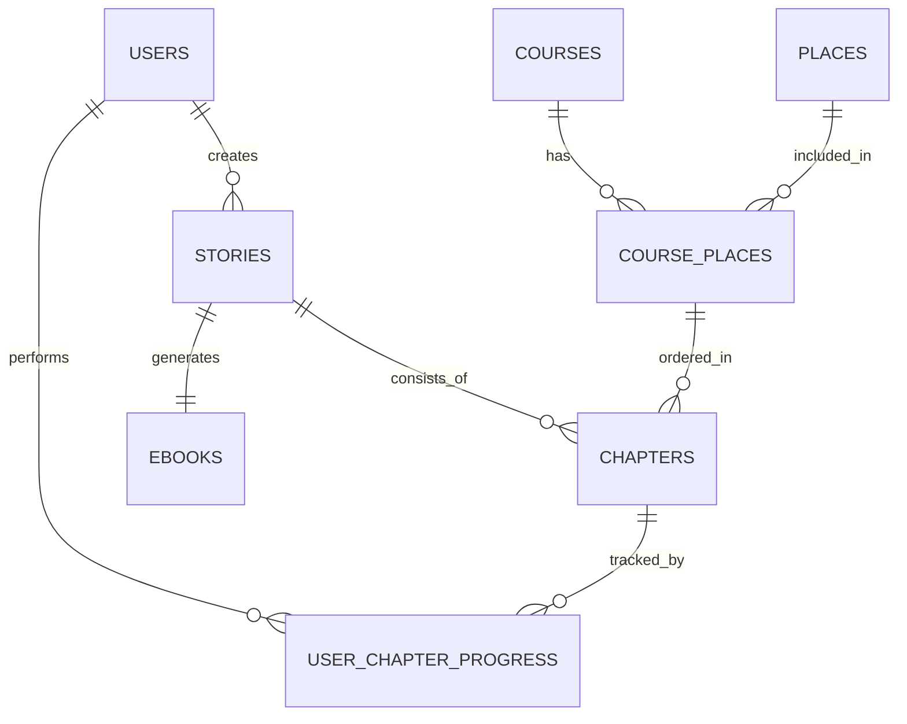

# 📄 아토리아 ERD 정리

---

## 🔥 서비스 전체 흐름

```mermaid
flowchart TD
    A[User] --> B[Course 선택]
    B --> C[Story 생성 (AI)]
    C --> D[Chapter 생성 (스토리 + 미션)]
    D --> E[User 미션 수행]
    E --> F[Progress 저장]
    F --> G[데이터 조합]
    G --> H[E-book 생성]
```

---

## 🧱 ERD 구조



---

# 📦 테이블 정의

## 1️⃣ users

```sql
users (
    user_id BIGINT PRIMARY KEY,
    email VARCHAR(255) UNIQUE NOT NULL,
    password VARCHAR(255) NOT NULL,
    nickname VARCHAR(50) UNIQUE NOT NULL,
    is_deleted BOOLEAN DEFAULT FALSE,
    created_at DATETIME DEFAULT CURRENT_TIMESTAMP,
    updated_at DATETIME DEFAULT CURRENT_TIMESTAMP 
           ON UPDATE CURRENT_TIMESTAMP
)
```

---

## 2️⃣ places

```sql
places (
    place_id BIGINT PRIMARY KEY,
    name VARCHAR(100) NOT NULL,
    longitude DECIMAL(10,7) NOT NULL,
    latitude DECIMAL(10,7) NOT NULL,
    description TEXT,
    address VARCHAR(255),
    category VARCHAR(50)
)
```

---

## 3️⃣ courses

```sql
courses (
    course_id BIGINT PRIMARY KEY,
    title VARCHAR(100) NOT NULL,
    description TEXT,
    created_at DATETIME DEFAULT CURRENT_TIMESTAMP,
    updated_at DATETIME DEFAULT CURRENT_TIMESTAMP 
           ON UPDATE CURRENT_TIMESTAMP
)
```

---

## 4️⃣ course_places (N:M 해결 테이블)

```sql
course_places (
    course_place_id BIGINT PRIMARY KEY,
    course_id BIGINT NOT NULL,
    place_id BIGINT NOT NULL,
    sequence INT NOT NULL,

    UNIQUE (course_id, place_id),

    FOREIGN KEY (course_id) REFERENCES courses(course_id),
    FOREIGN KEY (place_id) REFERENCES places(place_id)
)
```

---

## 5️⃣ stories

```sql
stories (
    story_id BIGINT PRIMARY KEY,
    user_id BIGINT NOT NULL,
    course_id BIGINT NOT NULL,
    title VARCHAR(255) NOT NULL,
    protagonist_info JSONB NOT NULL,
    intro TEXT,
    outro TEXT,
    created_at DATETIME DEFAULT CURRENT_TIMESTAMP,
    updated_at DATETIME DEFAULT CURRENT_TIMESTAMP 
           ON UPDATE CURRENT_TIMESTAMP,

    FOREIGN KEY (user_id) REFERENCES users(user_id),
    FOREIGN KEY (course_id) REFERENCES courses(course_id)
)
```

---

## 6️⃣ chapters

```sql
chapters (
    chapter_id BIGINT PRIMARY KEY,
    story_id BIGINT NOT NULL,
    course_place_id BIGINT NOT NULL,
    sequence INT NOT NULL,

    mission_title VARCHAR(100),
    mission_description TEXT,
    mission_type ENUM('PHOTO', 'CHOICE', 'QUIZ', 'ACTION'),

    story_content JSONB,

    created_at DATETIME DEFAULT CURRENT_TIMESTAMP,
    updated_at DATETIME DEFAULT CURRENT_TIMESTAMP 
           ON UPDATE CURRENT_TIMESTAMP,

    FOREIGN KEY (story_id) REFERENCES stories(story_id) ON DELETE CASCADE,
    FOREIGN KEY (course_place_id) REFERENCES course_places(course_place_id)
)
```

---

## 7️⃣ user_chapter_progress

```sql
user_chapter_progress (
    user_chapter_progress_id BIGINT PRIMARY KEY,
    user_id BIGINT NOT NULL,
    chapter_id BIGINT NOT NULL,

    is_completed BOOLEAN DEFAULT FALSE,

    choice VARCHAR(255),
    input_text TEXT,
    file_url VARCHAR(500),
    location_verification_status VARCHAR(30),

    started_at DATETIME,
    completed_at DATETIME,

    created_at DATETIME DEFAULT CURRENT_TIMESTAMP,
    updated_at DATETIME DEFAULT CURRENT_TIMESTAMP 
           ON UPDATE CURRENT_TIMESTAMP,

    UNIQUE (user_id, chapter_id),

    FOREIGN KEY (user_id) REFERENCES users(user_id),
    FOREIGN KEY (chapter_id) REFERENCES chapters(chapter_id)
)
```

---

## 8️⃣ ebooks

```sql
ebooks (
    ebook_id BIGINT PRIMARY KEY,
    story_id BIGINT NOT NULL,
    file_url VARCHAR(500),
    thumbnail_url VARCHAR(500),
    created_at DATETIME DEFAULT CURRENT_TIMESTAMP,
    
    FOREIGN KEY (story_id) REFERENCES stories(story_id) ON DELETE CASCADE
)
```

---

## 9️⃣ notifications

```sql
notifications (
    notification_id BIGINT PRIMARY KEY,
    type ENUM('MISSION', 'SYSTEM', 'EVENT') NOT NULL,
    message TEXT NOT NULL,
    is_read BOOLEAN DEFAULT FALSE,
    created_at DATETIME DEFAULT CURRENT_TIMESTAMP
)
```

---

# 🔗 관계 요약

## 👤 유저

* users 1 : N stories
* users 1 : N user_chapter_progress

---

## 🗺️ 코스 / 장소

* courses ↔ places = N : M
* course_places로 해결

---

## 📖 스토리 구조

* stories 1 : N chapters
* chapter = 장소 + 스토리 + 미션

---

## 🎯 유저 행동

* chapters 1 : N user_chapter_progress
* 선택 / 입력 / 파일 / 완료 상태 저장

---

## 📚 결과물

* stories 1 : 1 ebooks

---

# 🎯 핵심 요약

👉 전체 구조

```
유저 → 코스 → 스토리 생성 → 챕터(스토리+미션) → 수행 → 기록 → E-book
```
