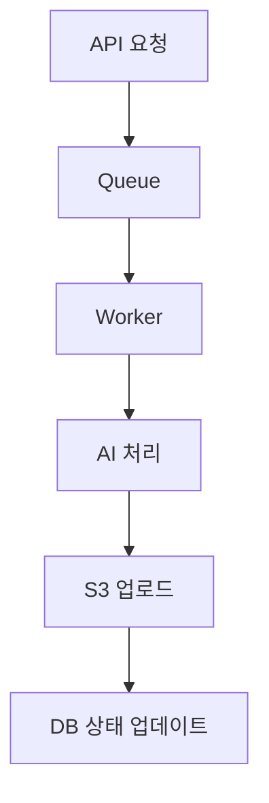

# 📄 AI Flow (Atoria)

본 문서는 Atoria 서비스의 **AI 스토리 생성 및 데이터 흐름 구조**를 정의합니다.
스토리 생성부터 E-book 생성까지의 전체 AI 처리 흐름을 설명합니다.

---

## 🎯 목표

* 사용자 행동 기반 **개인화 스토리 생성**
* 문화유산 탐방 경험을 **서사형 콘텐츠로 변환**
* 최종적으로 **E-book 형태의 결과물 제공**

---

## 🔥 전체 흐름

```mermaid id="ai-flow-diagram"
flowchart TD
    A[User] --> B[Story 생성 요청]
    B --> C[Backend]
    C --> D[AI 요청]
    D --> E[AI 응답 생성]
    E --> F[데이터 파싱]
    F --> G[DB 저장 (stories, chapters)]
    G --> H[User 진행]
    H --> I[데이터 누적]
    I --> J[E-book 생성 요청]
    J --> K[AI 콘텐츠 재조합]
    K --> L[파일 생성]
```

---

## 🧠 1. 스토리 생성 단계

### 📌 트리거

```plaintext id="trigger"
POST /stories
```

---

### 📌 입력 데이터

```json id="input-data"
{
  "courseId": 1,
  "protagonists": [
    {
      "name": "민준",
      "age": 5,
      "tendency": "모험적"
    }
  ]
}
```

---

### 📌 AI 요청 구성

```plaintext id="prompt-structure"
- 코스 정보 (places 순서 포함)
- 사용자 정보 (이름, 나이, 성향)
- 스토리 스타일 (동화, 모험 등)
```

---

### 📌 AI 응답 구조 (중요)

```json id="ai-response"
{
  "title": "민준이의 경주 시간여행",
  "intro": "...",
  "chapters": [
    {
      "sequence": 1,
      "placeId": 101,
      "story": "...",
      "mission": {
        "title": "...",
        "description": "...",
        "type": "PHOTO"
      }
    }
  ],
  "outro": "..."
}
```

---

### 📌 처리 흐름

```plaintext id="processing"
1. AI 응답 수신
2. JSON 파싱
3. stories 저장
4. chapters 분리 저장
```

---

## 🧱 2. 데이터 저장 구조

### stories

* title
* intro
* outro

---

### chapters

* sequence
* place_id
* story_content
* mission (title, description, type)

---

## 🎮 3. 사용자 진행 단계

### 📌 수행 흐름

```plaintext id="user-flow"
1. 챕터 조회
2. 미션 수행
3. 결과 제출
4. progress 저장
```

---

### 📌 저장 데이터

```plaintext id="progress-data"
- is_completed
- choice
- input_text
- file_url
- completed_at
```

---

## 📊 4. 데이터 축적

AI 생성이 아닌 **유저 행동 데이터 기반 축적**

---

### 📌 수집 데이터

* 방문 순서
* 선택지
* 텍스트 입력
* 이미지 업로드

---

👉 이후 E-book 생성 시 활용

---

## 📚 5. E-book 생성 단계

### 📌 트리거

```plaintext id="ebook-trigger"
POST /file/ebook
```

---

### 📌 입력 데이터

```plaintext id="ebook-input"
- story (intro + outro)
- chapters (story + mission 결과)
- user progress 데이터
```

---

### 📌 AI 처리

```plaintext id="ebook-ai"
1. 스토리 재구성
2. 사용자 행동 반영
3. 서사 강화
```

---

### 📌 결과

```plaintext id="ebook-output"
- PDF (E-book)
- 이미지 썸네일
```

---

## ⚡ 6. 비동기 처리 (중요)

### 📌 대상

* E-book 생성
* 영상 생성 (확장)

---

### 📌 구조



---

### 📌 상태 관리

```plaintext id="status"
PROCESSING
COMPLETED
FAILED
```

---

## 🔥 7. 핵심 설계 포인트

---

### 1. AI는 "한 번에 생성"

```plaintext id="point1"
스토리 + 챕터 + 미션 → 한번에 생성
```

---

### 2. DB는 정규화 유지

```plaintext id="point2"
AI 응답 → 분해 → DB 저장
```

---

### 3. 유저 데이터는 AI 입력이 됨

```plaintext id="point3"
행동 데이터 → E-book 재생성
```

---

### 4. 생성과 조회 분리

```plaintext id="point4"
POST (생성) / GET (조회)
```

---

## 💥 최종 요약

```plaintext id="summary"
1. AI가 전체 스토리를 생성
2. Backend가 구조화하여 저장
3. 유저 행동 데이터 축적
4. 최종적으로 개인화 E-book 생성
```

---

## 🚀 결론

👉 **AI는 콘텐츠 생성, DB는 구조 관리, 유저는 경험을 완성한다**
