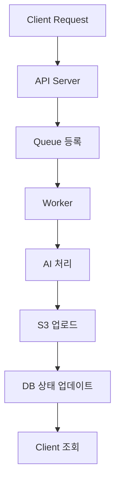

# 📄 Async Processing (Atoria)

본 문서는 Atoria 서비스의 **비동기 처리 구조 및 설계 전략**을 정의합니다.
AI 처리, 파일 생성, 대용량 작업을 안정적으로 처리하기 위한 구조입니다.

---

## 🎯 목표

* 응답 속도 개선 (UX 향상)
* AI 처리 지연 최소화
* 서버 부하 분산
* 실패 시 안정적인 재처리

---

## 🔥 비동기 처리 대상

### 1. E-book 생성 ⭐

* PDF 생성
* 이미지 렌더링
* 파일 업로드

---

### 2. 영상 생성 (확장)

* AI 영상 콘텐츠 생성

---

### 3. 대용량 AI 요청

* 스토리 재생성
* 데이터 재조합

---

## 🧱 전체 구조



---

## ⚙️ 구성 요소

### 1. API Server

* 요청 수신
* 작업 큐 등록

---

### 2. Queue (메시지 큐)

* 작업 대기열
* 비동기 작업 전달

📌 선택지

```plaintext id="queue-options"
- Redis (간단)
- RabbitMQ (안정성)
- Kafka (대규모)
```

---

### 3. Worker

* 큐에서 작업 가져옴
* 실제 처리 수행

---

### 4. Storage (S3)

* 결과 파일 저장

---

### 5. Database

* 상태 관리

---

## 🔄 처리 흐름

### 1. 요청

```plaintext id="request"
POST /file/ebook
```

---

### 2. 즉시 응답

```json id="async-response"
{
  "status": "PROCESSING",
  "fileId": "uuid-1234"
}
```

---

### 3. 백그라운드 처리

```plaintext id="background"
1. Queue에 작업 등록
2. Worker 실행
3. AI 호출
4. 파일 생성
5. S3 업로드
6. DB 상태 업데이트
```

---

### 4. 결과 조회

```plaintext id="polling"
GET /file/{fileId}
```

---

## 📊 상태 관리

```plaintext id="status-flow"
PROCESSING → COMPLETED
PROCESSING → FAILED
```

---

## 📌 상태 컬럼 (DB)

```sql id="status-db"
status VARCHAR(20) NOT NULL
```

---

## ⚡ 실패 처리 전략

### 1. Retry

```plaintext id="retry"
- 최대 3회 재시도
- 지수 백오프 적용
```

---

### 2. Dead Letter Queue

```plaintext id="dlq"
실패 작업 별도 저장
```

---

### 3. 로그 기록

```plaintext id="logging"
에러 로그 + 요청 데이터 저장
```

---

## 🚀 성능 최적화 전략

---

### 1. Worker 분리

```plaintext id="worker"
API 서버 ≠ Worker 서버
```

---

### 2. 작업 병렬 처리

```plaintext id="parallel"
여러 Worker 동시 실행
```

---

### 3. Queue 기반 확장

```plaintext id="scaling"
트래픽 증가 → Worker 추가
```

---

## 🔐 데이터 정합성

* fileId 기준 상태 관리
* 중복 요청 방지
* idempotency 고려

---

## 🧠 설계 핵심

---

### 1. 사용자 응답은 빠르게

```plaintext id="point1"
요청 → 바로 응답 → 뒤에서 처리
```

---

### 2. AI는 항상 비동기

```plaintext id="point2"
AI = 느림 → 반드시 분리
```

---

### 3. 상태 기반 시스템

```plaintext id="point3"
status로 흐름 제어
```

---

## 💥 최종 요약

```plaintext id="summary"
1. API는 요청만 받고 바로 응답
2. Queue에 작업 넣고 Worker가 처리
3. 결과는 S3 + DB 상태로 관리
4. 클라이언트는 polling으로 확인
```

---

## 🚀 결론

👉 **비동기는 “속도를 위한 구조”가 아니라 “안정성을 위한 구조”다**
